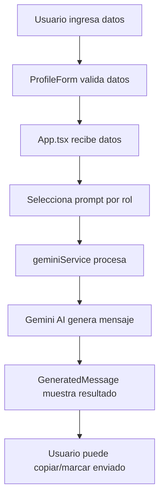
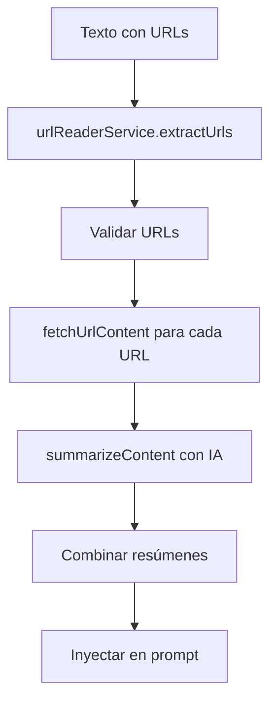
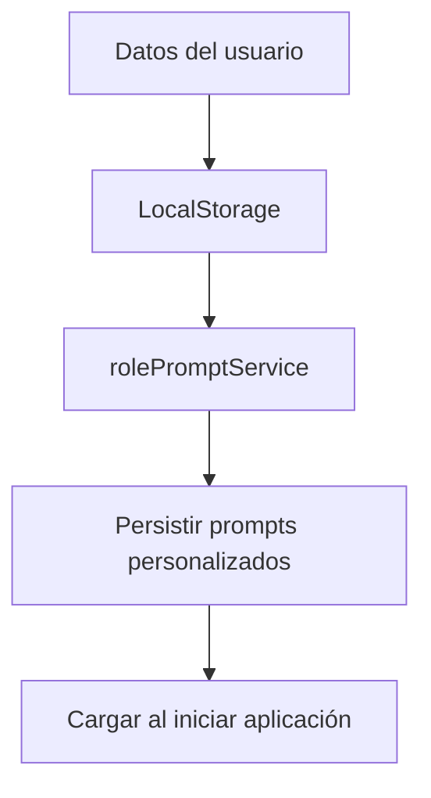

# Documentación de Arquitectura - Reteki Outreach

## 📋 Índice
1. [Visión General](#visión-general)
2. [Arquitectura del Sistema](#arquitectura-del-sistema)
3. [Componentes Frontend](#componentes-frontend)
4. [Servicios Backend](#servicios-backend)
5. [Flujo de Datos](#flujo-de-datos)
6. [Patrones de Diseño](#patrones-de-diseño)
7. [Integración con APIs](#integración-con-apis)
8. [Gestión de Estado](#gestión-de-estado)
9. [Seguridad](#seguridad)
10. [Escalabilidad](#escalabilidad)

## 🎯 Visión General

Reteki Outreach es una aplicación web de una sola página (SPA) que utiliza inteligencia artificial para generar mensajes personalizados de LinkedIn y email. La arquitectura está diseñada para ser escalable, mantenible y eficiente.

### Principios Arquitectónicos
- **Separación de responsabilidades**: Frontend y backend claramente separados
- **Modularidad**: Componentes reutilizables y servicios independientes
- **Escalabilidad**: Diseño que permite crecimiento horizontal
- **Mantenibilidad**: Código limpio y bien documentado
- **Seguridad**: Validación y sanitización en todas las capas

## 🏗️ Arquitectura del Sistema

### Diagrama de Alto Nivel

```
┌─────────────────────────────────────────────────────────────────┐
│                        CLIENTE (Browser)                        │
├─────────────────────────────────────────────────────────────────┤
│  React SPA  │  LocalStorage  │  Service Workers  │  PWA Cache  │
└─────────────────────────────────────────────────────────────────┘
                                    │
                                    ▼
┌─────────────────────────────────────────────────────────────────┐
│                      CDN / Load Balancer                       │
│                    (Cloudflare / Nginx)                        │
└─────────────────────────────────────────────────────────────────┘
                                    │
                                    ▼
┌─────────────────────────────────────────────────────────────────┐
│                    SERVIDOR DE APLICACIÓN                      │
├─────────────────────────────────────────────────────────────────┤
│  Node.js App  │  PM2 Cluster  │  Nginx Proxy  │  SSL/TLS      │
└─────────────────────────────────────────────────────────────────┘
                                    │
                                    ▼
┌─────────────────────────────────────────────────────────────────┐
│                    SERVICIOS EXTERNOS                          │
├─────────────────────────────────────────────────────────────────┤
│  Google Gemini AI  │  URL Reader  │  Analytics  │  Monitoring  │
└─────────────────────────────────────────────────────────────────┘
                                    │
                                    ▼
┌─────────────────────────────────────────────────────────────────┐
│                    PERSISTENCIA DE DATOS                       │
├─────────────────────────────────────────────────────────────────┤
│  PostgreSQL  │  Redis Cache  │  File System  │  LocalStorage  │
└─────────────────────────────────────────────────────────────────┘
```

### Capas de la Aplicación

#### 1. Capa de Presentación (Frontend)
- **React 19**: Framework principal
- **TypeScript**: Tipado estático
- **Tailwind CSS**: Estilos y diseño
- **Vite**: Build tool y bundling

#### 2. Capa de Lógica de Negocio
- **Servicios**: Lógica de negocio encapsulada
- **Hooks**: Lógica de estado reutilizable
- **Utils**: Funciones auxiliares

#### 3. Capa de Datos
- **LocalStorage**: Persistencia local
- **APIs Externas**: Integración con servicios
- **Cache**: Optimización de rendimiento

#### 4. Capa de Infraestructura
- **Servidor Web**: Nginx
- **Procesos**: PM2
- **Monitoreo**: Logs y métricas

## 🧩 Componentes Frontend

### Estructura de Componentes

```
src/
├── components/
│   ├── App.tsx                 # Componente raíz
│   ├── ProfileForm.tsx         # Formulario de perfil
│   ├── GeneratedMessage.tsx    # Visualizador de mensajes
│   ├── RolePromptEditor.tsx    # Editor de prompts
│   ├── SentMessagesView.tsx    # Historial de mensajes
│   ├── SettingsModal.tsx       # Configuración
│   └── icons/                  # Iconos SVG
├── services/
│   ├── geminiService.ts        # Servicio de IA
│   ├── rolePromptService.ts    # Gestión de prompts
│   └── urlReaderService.ts     # Procesamiento de URLs
└── types.ts                    # Definiciones de tipos
```

### Componentes Principales

#### App.tsx - Componente Raíz
```typescript
interface AppState {
  view: View;
  profileData: ProfileData;
  generatedMessage: string;
  selectedRole: TargetRole;
  messageType: MessageType;
  // ... otros estados
}

// Responsabilidades:
// - Gestión del estado global
// - Navegación entre vistas
// - Coordinación de servicios
// - Manejo de eventos
```

#### ProfileForm.tsx - Formulario de Datos
```typescript
interface ProfileFormProps {
  data: ProfileData;
  onUpdate: (field: K, value: ProfileData[K]) => void;
  onSubmit: (e: React.FormEvent) => void;
  selectedRole: TargetRole;
  messageType: MessageType;
}

// Responsabilidades:
// - Captura de datos del perfil
// - Validación de entrada
// - Indicadores de estado
// - Integración con generación
```

#### RolePromptEditor.tsx - Editor de Prompts
```typescript
interface RolePromptEditorProps {
  isOpen: boolean;
  selectedRole: TargetRole;
  onRoleChange: (role: TargetRole) => void;
  onClose: () => void;
}

// Responsabilidades:
// - Edición de prompts por rol
// - Persistencia de cambios
// - Validación de contenido
// - Interfaz de usuario
```

## 🔌 Servicios Backend

### Servicios Principales

#### geminiService.ts - Servicio de IA
```typescript
// Funciones principales:
export const generateLinkedInMessage = async (
  data: ProfileData,
  promptTemplate: string,
  messageType: MessageType
): Promise<GeneratedMessageResponse>

export const extractProfileDataFromText = async (
  text: string
): Promise<ProfileData>

export const extractMultipleProfilesFromText = async (
  text: string
): Promise<ProfileData[]>

// Responsabilidades:
// - Integración con Google Gemini AI
// - Generación de mensajes personalizados
// - Extracción de datos de perfiles
// - Procesamiento de URLs
// - Validación de respuestas
```

#### rolePromptService.ts - Gestión de Prompts
```typescript
// Funciones principales:
export const getRolePrompt = (role: TargetRole): RolePrompt
export const getAllRoles = (): RolePrompt[]
export const saveRolePrompt = (role: TargetRole, prompt: Partial<RolePrompt>): void
export const loadRolePrompts = (): void

// Responsabilidades:
// - Definición de prompts por rol
// - Persistencia en localStorage
// - Carga y guardado de personalizaciones
// - Validación de datos
```

#### urlReaderService.ts - Procesamiento de URLs
```typescript
// Funciones principales:
export const extractUrls = (text: string): string[]
export const processUrls = (urls: string[]): Promise<UrlProcessResult[]>
export const fetchUrlContent = (url: string): Promise<UrlContent>
export const summarizeContent = (content: string): Promise<string>

// Responsabilidades:
// - Extracción de URLs de texto
// - Validación de URLs
// - Lectura de contenido web
// - Resumen con IA
```

## 🔄 Flujo de Datos

### 1. Flujo de Generación de Mensajes



### 2. Flujo de Procesamiento de URLs



### 3. Flujo de Persistencia



## 🎨 Patrones de Diseño

### 1. Patrón de Servicios
```typescript
// Encapsulación de lógica de negocio
class GeminiService {
  private static instance: GeminiService;
  
  public static getInstance(): GeminiService {
    if (!GeminiService.instance) {
      GeminiService.instance = new GeminiService();
    }
    return GeminiService.instance;
  }
}
```

### 2. Patrón de Hooks
```typescript
// Lógica de estado reutilizable
const useProfileData = () => {
  const [profileData, setProfileData] = useState<ProfileData>(initialData);
  
  const updateField = useCallback((field: K, value: ProfileData[K]) => {
    setProfileData(prev => ({ ...prev, [field]: value }));
  }, []);
  
  return { profileData, updateField };
};
```

### 3. Patrón de Composición
```typescript
// Componentes compuestos
const ProfileForm = ({ data, onUpdate, selectedRole, messageType }) => {
  return (
    <form>
      <RoleIndicator role={selectedRole} type={messageType} />
      <InputField field="name" value={data.name} onChange={onUpdate} />
      <InputField field="jobTitle" value={data.jobTitle} onChange={onUpdate} />
      {/* ... más campos */}
    </form>
  );
};
```

## 🔗 Integración con APIs

### Google Gemini AI
```typescript
// Configuración de la API
const ai = new GoogleGenAI(process.env.GEMINI_API_KEY);

// Generación de contenido
const response = await ai.models.generateContent({
  model: 'gemini-2.5-flash',
  contents: prompt,
  config: {
    responseMimeType: 'application/json',
    responseSchema: messageResponseSchema,
    temperature: 0.3
  }
});
```

### Procesamiento de URLs
```typescript
// Flujo de procesamiento
const processUrls = async (urls: string[]): Promise<UrlProcessResult[]> => {
  const results = await Promise.allSettled(
    urls.map(async (url) => {
      const content = await fetchUrlContent(url);
      const summary = await summarizeContent(content.text);
      return { url, success: true, title: content.title, summary };
    })
  );
  
  return results.map((result, index) => ({
    url: urls[index],
    success: result.status === 'fulfilled',
    ...(result.status === 'fulfilled' ? result.value : { error: result.reason })
  }));
};
```

## 📊 Gestión de Estado

### Estado Global de la Aplicación
```typescript
interface AppState {
  // Navegación
  view: View;
  
  // Datos del perfil
  profileData: ProfileData;
  
  // Generación de mensajes
  generatedMessage: string;
  isLoading: boolean;
  error: string;
  
  // Configuración
  selectedRole: TargetRole;
  messageType: MessageType;
  promptTemplate: string;
  
  // Procesamiento múltiple
  rawProfileText: string;
  results: Result[];
  isProcessing: boolean;
  processingError: string;
  
  // UI
  isSettingsOpen: boolean;
  isRoleEditorOpen: boolean;
}
```

### Patrones de Actualización de Estado
```typescript
// Actualización inmutable
const updateProfileData = useCallback(<K extends keyof ProfileData>(
  field: K, 
  value: ProfileData[K]
) => {
  setProfileData(prev => ({ ...prev, [field]: value }));
}, []);

// Estado derivado
const charLimit = messageType === 'linkedin' ? 300 : 1500;
const isOverLimit = generatedMessage.length > charLimit;
```

## 🔒 Seguridad

### Medidas de Seguridad Implementadas

#### 1. Validación de Entrada
```typescript
// Sanitización de URLs
const isValidUrl = (url: string): boolean => {
  try {
    const parsedUrl = new URL(url);
    return parsedUrl.protocol === 'https:' && 
           !parsedUrl.hostname.includes('localhost') &&
           !parsedUrl.hostname.includes('127.0.0.1');
  } catch {
    return false;
  }
};
```

#### 2. Protección de API Keys
```typescript
// Variables de entorno
const apiKey = process.env.GEMINI_API_KEY;
if (!apiKey) {
  throw new Error('GEMINI_API_KEY is required');
}
```

#### 3. Sanitización de Contenido
```typescript
// Limpieza de datos antes del procesamiento
const sanitizeContent = (content: string): string => {
  return content
    .replace(/<script\b[^<]*(?:(?!<\/script>)<[^<]*)*<\/script>/gi, '')
    .replace(/javascript:/gi, '')
    .trim();
};
```

## 📈 Escalabilidad

### Estrategias de Escalabilidad

#### 1. Escalabilidad Horizontal
```typescript
// PM2 Cluster Mode
module.exports = {
  apps: [{
    name: 'reteki-outreach',
    script: 'npm',
    args: 'start',
    instances: 'max',
    exec_mode: 'cluster'
  }]
};
```

#### 2. Caché y Optimización
```typescript
// Caché de respuestas de IA
const cache = new Map();

const getCachedResponse = (key: string) => {
  return cache.get(key);
};

const setCachedResponse = (key: string, value: any) => {
  cache.set(key, value);
  // TTL de 1 hora
  setTimeout(() => cache.delete(key), 3600000);
};
```

#### 3. Lazy Loading
```typescript
// Carga diferida de componentes
const RolePromptEditor = lazy(() => import('./components/RolePromptEditor'));
const SentMessagesView = lazy(() => import('./components/SentMessagesView'));
```

### Métricas de Rendimiento

#### Objetivos de Rendimiento
- **Tiempo de carga inicial**: < 3 segundos
- **Tiempo de generación**: < 10 segundos
- **Tamaño del bundle**: < 500KB
- **Lighthouse Score**: > 90

#### Optimizaciones Implementadas
- **Code splitting**: Carga diferida de componentes
- **Tree shaking**: Eliminación de código no utilizado
- **Minificación**: Compresión de assets
- **Gzip**: Compresión de respuestas
- **CDN**: Distribución de contenido estático

## 🔧 Mantenimiento

### Estrategias de Mantenimiento

#### 1. Monitoreo Continuo
```typescript
// Logging estructurado
const logger = {
  info: (message: string, data?: any) => {
    console.log(`[INFO] ${new Date().toISOString()}: ${message}`, data);
  },
  error: (message: string, error?: Error) => {
    console.error(`[ERROR] ${new Date().toISOString()}: ${message}`, error);
  }
};
```

#### 2. Testing
```typescript
// Tests unitarios para servicios
describe('GeminiService', () => {
  it('should generate message with valid data', async () => {
    const result = await generateLinkedInMessage(mockData, mockPrompt, 'linkedin');
    expect(result.shouldGenerate).toBe(true);
    expect(result.message).toBeDefined();
  });
});
```

#### 3. Documentación
- **Código autodocumentado**: Comentarios y tipos claros
- **README actualizado**: Instrucciones de uso
- **API docs**: Documentación de servicios
- **Arquitectura**: Diagramas y explicaciones

---

**Última actualización**: Diciembre 2024
**Versión**: 1.0.0
**Mantenido por**: Equipo de Desarrollo Reteki
